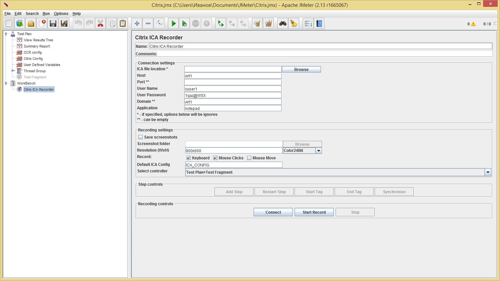
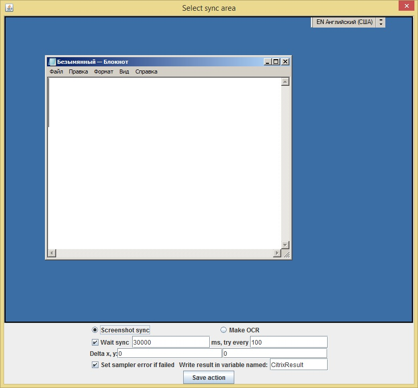
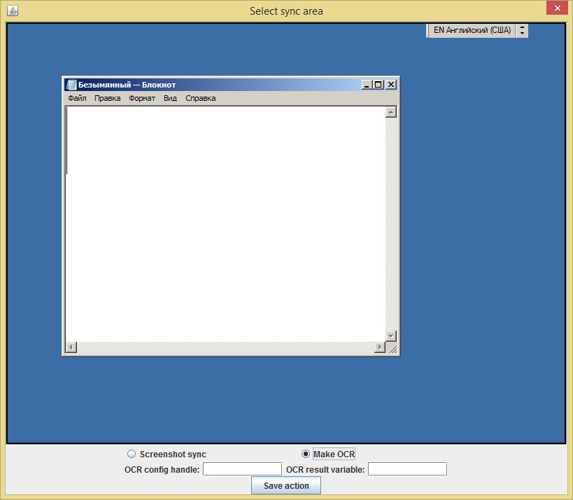
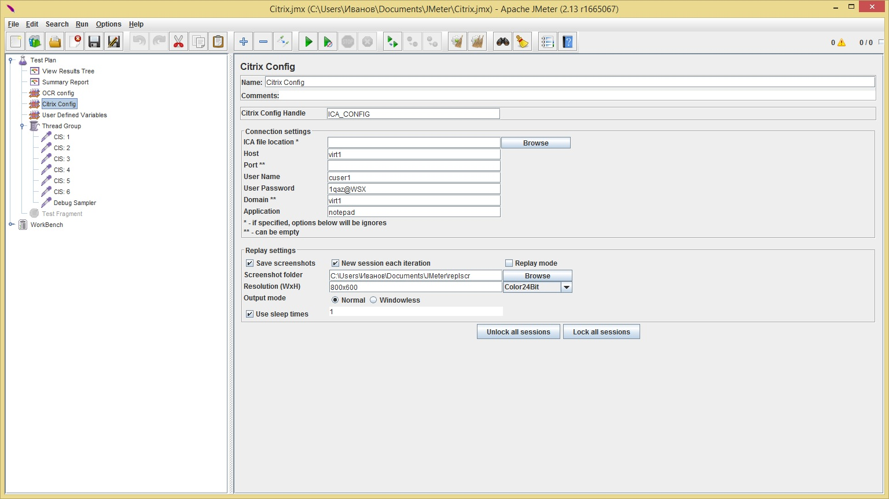
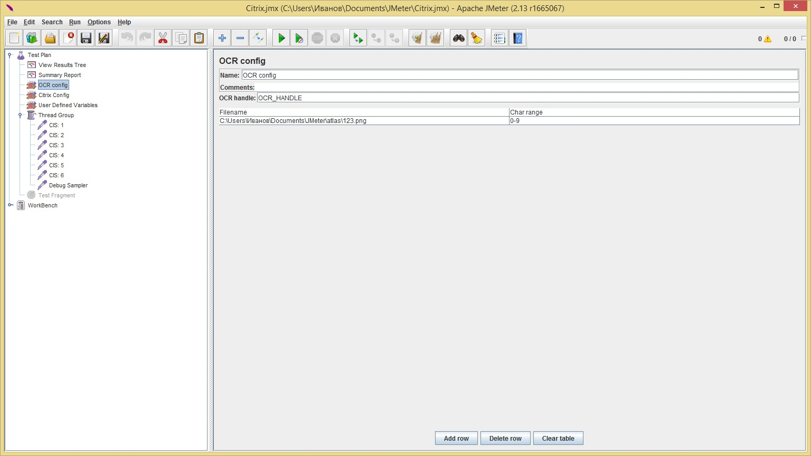
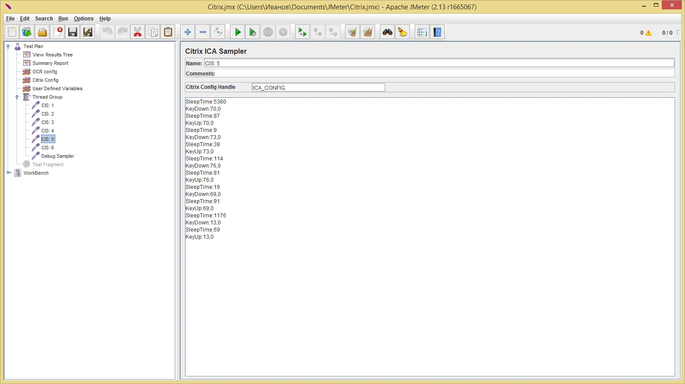

# Citrix client 

The plugin allows you to communicate with the Citrix protocol via the Citrix Receiver client.

You can download it [here][1].

[1]: (https://github.com/pflb/Jmeter-Citrix-Plugin/releases/download/v1.0/CitrixICA.zip)

## Introduction

---
Using HP LoadRunner to record and play scripts on Citrix is not always suitable for customers due to the high cost of 
the first one. So it was decided to try to make friendship with JMeter Citrix. This article will talk about installing 
and using this plugin.

## Opportunities 

---
- Recording user action (keyboard input, mouse click and movement) with the choice of the 
right input sources.
- Playing the recorded script.
- Running the session via .ica files.
- Running sessions with the selected parameters (Citrix area size, colour depth).
- Ability to (not) save screenshots taken during recording/playback.
- The ability to parameterise any command/parameter in the samplers.
- The ability to specify the multiplier of all *thinktime*.
- The ability to run sessions without blocking the user's input.
- Wide synchronisation settings.
- Ability to specify (in theory) an infinite number of hash sums for synchronisation.
- OCR (Optical Character Recognition) engine for text recognition is integrated.
- A setup that allows you not to run a new session every time you iterate.
- Remote Start support.
- Free, open source.

## Restrictions 

---
- Only works with JRE x86. When using the 64-bit version, it doesn't find a COM class.
- At the moment, it is impossible to run sessions in Windowless mode (without displaying a window).
- In some cases, the colour rendering parameter is ignored.

## Installation of the plugin 

---
### Requirement
The following is necessary for the plugin to work correctly:
- JMeter for the plugin to work;
- Com4j library to work with COM (need for the plugin, download here);
- JRE x86 version 7 and above for correct operation of COM4J and plugin (can be compiled for JRE version 6);
- Citrix Receiver, through which recording and playback will take place.

### Installation
I won't describe how to install JMeter and JRE, I think everyone already knows that. Installing Citrix Receiver is 
not difficult either, so let's move on to installing the plugin right away. To install the plugin itself, it is enough
to copy the `.jar` files of the com4j library to the lib folder at the root of JMeter, and the plugin itself to `lib/ext`
. But to be able to write/play, you also need to add a record to the registry (the path is for Windows x64, for 32-bit 
editions you need to remove the Wow6432Node subdirectory from the path):
```
Windows Registry Editor Version 5.00

[HKEY_LOCAL_MACHINE\SOFTWARE\Wow6432Node\Citrix\ICA Client\CCM]
"AllowSimulationAPI"=dword:00000001
```
You can save this text to a text file with the `.reg` extension and add a record to the registry by running this file.

## Script recording

---
### Preparing


To write scripts, you need to add the Citrix ICA Recorder element to WorkBench (located in the Non-Test 
Elements category) and specify the correct connection parameters there:
- **ICA file location** is the path to the .ica file to initialise the session. If specified, the remaining connection parameters will be ignored. You can select via GUI by pressing the Browse button;
- **Host** - server address;
- **Port** is a port to connect. If not specified, a standard one is used;
- **User Name** - the name of the user who is allowed access to the published application;
- **User Password** - user password;
- **Domain** is a user domain that can be empty;
- **Application** - the name of the published application;

You should also adjust the recording parameters:
- **Save screenshots** - if enabled, the screenshots taken during recording will be saved;
- **Screenshot folder** is the path to the folder where the screenshots will be saved. The Browse button allows you 
  to select a path via GUI;
- **Resolution (WxH)** - specifies the size of the Citrix application workspace (maximum window size). 
  Specified in <WIDE>x<HIGH> format, separator - Latin x;
- **Colour 24 bit** - indicates what colour depth to use;
- **Record:** - indicates which events to record and which not. Possible options: Keyboard - record keyboard events,
  Mouse Clicks - record mouse button presses, Mouse Move - record mouse cursor movement events;
- **Default ICA Config** - indicates which ICA Config Element to use in the recorded samplers by default (this will be described in detail below);
- **Select controller** - indicates which controller to place the recorded samplers in;

### Recording of the session

Once all the settings have been entered, you can connect to the session and start recording. There is a group 
of Recording controls buttons in the record to enable/off the record. The Connect button simply connects to the 
session. The record doesn't start and can be enabled later. The Record button connects and immediately starts 
recording the selected actions. The Stop button allows you to stop recording and disconnect from the session.
At the same time, the session itself (Citrix Receiver window) does not close. Also, when you exit a session
(for example, when you close an application), the LogOut event automatically stops recording.

There is a group of Step controls buttons to control the steps. It becomes available after the recording mode is 
enabled. The Add Step button saves the current step and adds it to the selected controller. At the same time,
the entry begins to take place in a new sampler. The Restart Step button simply clears the current step of
all actions (useful in case of an error). The Start Tag button labels that all commands written before pressing
the End Tag button will be ignored and text entered by the user will be inserted instead. The End Tag button,
respectively, puts the end mark for the Start Tag command. The Synchronise button takes a screenshot of the entire
Citrix session area and calls the synchronisation configuration dialogue, which I want to discuss in more detail.

### Synchronisation
At the moment, 2 synchronisation options have been implemented: by screenshot and by text (by using OCR).

####Synchronisation by screenshots


To synchronise by screenshot, select the synchronisation area (red translucent rectangle) and set the correct parameters.

- **Wait sync** - indicates whether to wait for the area with the specified hash to be found and how long (maximum) to wait. 
  The second parameter, try every, indicates how often to do the check. Parameters are given by integers in milliseconds.
- **Delta x, y** - indicates at what maximum distance to look for the desired area in width and height, respectively. Useful 
  in cases where the element on which synchronisation is performed can shift slightly. But it's completely useless if the 
  element changes its size, because the hash sum of the screenshot will be different.

- **Set sampler error if failed** - indicates whether to mark the sampler to failed if the specified area could not be 
  found in the specified time. If not worth it, the sampler will always be considered successful and the only way to
  distinguish whether an area has appeared or not will be checked for the value of the variable specified in the next paragraph.
- **Write result in variable named** - specifies the name of the variable to which to write the success of 
  synchronisation. The output in the variable will be true if the area is found, otherwise false. This type of 
  synchronisation occurs by comparing the hash sum screenshots of these areas when recording and playing. Accordingly, 
  changing the colour of one pixel during playback will change the hash sum of the screenshot beyond recognition, which
  will lead to a comparison error and the area will be considered not found.
  
#### Synchronisation by text


To synchronise by text, you also need to select the area of the screen where the text will be recognised. You also 
need to specify two parameters: OCR config handle - the string specified in the OCR Config test element in the 
OCR Handle  field (about this later), which selects the configured OCR engine to be used for recognition, 
and OCR result variable - the name of the variable to which the result will be written. If nothing can be recognised, 
the variable will be created and initialised with an empty string.

## Preparing for playback
After recording the script, you should get a test plan with a controller and Citrix ICA Samplers inside. At least 
one Citrix ICA Config item is required to play the session.

### Playback configuration.


**Citrix ICA config** looks very similar to **Citrix ICA Recorder**. It has exactly the same connection parameters, so there 
is no point in describing them here, just mention that all the fields in the connection configuration can be 
parameterised, and these values will be used when initialising the session, that is, when performing the first 
**Citrix ICA Sampler** you come across. For example, you can safely use **CSV Data Set Config** to parameterise fields.
The **Citrix Config Handle** field should be unique to all such configs. From it, the samplers determine which connection
settings to use and hook up the session to continue the test.

The session playback settings are different from those in the record. I'll stop at the discrepancies:
- **New session each iteration** - if specified, a new session will be created each iteration. The old one, if not 
  closed, will remain active, but will be inactive.
- **Replay mode** - if specified, all input in running sessions will be denied. Otherwise, the user will be able to 
  use the mouse/keyboard to enter data into an open application. It's necessary to debug it soon.
- **Output mode** is the mode of displaying a window. If Normal is specified, the window will be displayed. 
  If Windowless is specified, the window will not be displayed, thus saving loadstation resources (in the current 
  version it was not possible to achieve the result, Receiver ignores this setting).
- **Use sleep times** - if specified, all recorded/injected manual delays will be played. You can also specify a 
  multiplier by which waiting times will multiply (only for SleepTime commands).
- **Unlock all sessions** and Lock all sessions - unlocks and blocks input in all active sessions, i.e. changes the
  Replay mode parameter to "flight." Works only with those sessions that are running on the active JMeter and do not 
  work when running on remote servers.
  
### OCR configuration


If text recognition actions were recorded during recording, you should also add an OCR Config element. 
It's quite simple and has only two parameters:
- **OCR handle** is a parameter that differs from Citrix ICA Handle only in that it does not identify Citrix ICA Config,
  but OCR Config. Must be unique to all OCR Config.
- **Table** - the left column indicates the path to the image with which the training takes place, in the right 
  column - the symbol in the image (specified in the format <Interial symbol>-<Final character> without corner 
  brackets and with a separator in the form of a dash). Educational images are an image on which symbols are printed 
  in order (can be built, you can use a table). A prerequisite is that the range of codes of the specified characters
  must be continuous and directed upwards. Each image should have only one range.
  
### Sampler description


In addition to the standard title and comment, Citrix ICA Sampler contains two fields. The first one, Citrix Config 
Handle, indicates what settings to use, to start a session or from which pool to take an already active session. 
The second field contains a list of all the commands it will execute. This field can be fully parameterised using 
JMeter's variables.

###Command description

Each command consists of the name of the command and parameters, each command starts with a new line. If there is
a grid sign (#) at the beginning of the line, the line is considered a comment and will not be executed. An empty
sampler will start the session (unless it was initiated) and do nothing else. After the command, there should be
a colon and a list of parameters is listed separated by a comma. All commands, except for synchronisation by 
screenshots, have a fixed number of parameters. Now more about the teams.
- **SleepTime** is a team that delays the delay. Its only parameter is the time in milliseconds, during which the
  flow will stand idle. Set by an integer.
- **KeyDown and KeyUp** - presses and releases the key on the keyboard, respectively. Adopts 2 parameters: 
  the first is the key code that will be pressed/released. The second is a modifier (Alt, Control, etc.), 
  which is not currently in use. But without him, the team will throw out an exception.
- **MouseDown and MouseUp** - presses and releases the mouse button, respectively. Adopts 4 parameters:
  mouse button code, click modifier, X-coordinate on the screen and Y-coordinate on the screen. The second parameter,
  unlike KeyDown and KeyUp, is passed to the receiver, but at the moment it is not known whether it affects something 
  (and not many applications that handle such mouse clicks).
- **MouseDClick** is a team left over from the development stage. It will be ignored in the future. Does nothing.
  The parameters are identical to KeyUp and KeyDown.
- **MouseMove** - moves the mouse cursor around the screen. The parameters are identical to MouseDown and MouseUp.
- **StartTag** - indicates that all commands before the EndTag command will be ignored, and instead text from the
  parameters is entered. Accepts 2 parameters: the first is the time between entering characters in milliseconds,
  the second is the text to enter. Only one-line text is supported.
- **EndTag** - indicates the end of the StartTag command. Takes one parameter. The value of the parameter does not
  matter by default is null.
- **Screenshot** - synchronise. Accepts the list of hash sum areas and parameters. First there is a list of hash sums 
  separated by a comma. Represent strings. Next is a list of parameters. The first is the coordinate X, the second is
  the Y coordinate of the upper left corner of the area at which synchronisation will take place. The third parameter
  is the width, the fourth parameter is the height of the area. The fifth and sixth parameters - shift along the X axis
  and along the Y axis in both directions - the number of pixels within which the desired area will be searched if the
  area is not found in the centre. Can help when the elements on the screen can shift. 1-6 parameter - integers.
  The seventh parameter indicates whether it is necessary to wait for this area to appear or only to check for it.
  It's a boolean value (true/false). The eighth parameter is the waiting time of the area, the ninth parameter is
  the check interval. Set in milliseconds. Ignore if the seventh parameter is false. Represent integers. It is an 
  integer. The tenth parameter is whether to set the sample error status if the area is not found. It can be true or
  false. The last parameter is the name of the variable in which the synchronisation result will be entered: true if
  the area is found or false if not found.
- **OCR** is a text recognition command in the area. The first four parameters are the coordinates and size of the area,
  the equivalents are in the Screenshot command. The fifth parameter is a string that characterises which OCR config 
  to use for recognition. The sixth parameter is the name of the variable in which the result will be entered.
  
## Playing the script
To play a recorded and parameterised script, just run the test. After passing each sample in Response Data, 
you can see the success of each command.

### Tips
If .ica files are used to initialise sessions, it is better to parameterise the field responsible for it. Since this
file is disposable, the second thread (iteration) will not be able to run with the same file. To solve this problem, 
you can get these files just before the session starts using, for example, a web protocol.

If the sample fails to manage the session within 120 seconds, an attempt will be made to logout and disconnect the 
session within another 60 seconds, after which a second attempt will be made to reconnect.

If in rare cases there is an error when synchronising by screenshots - do not be upset, try adding the hash sum received
during playback to the sampler (the hash sum can be viewed on the Response Data tab in View Results Tree if there was
an error during synchronisation).

If one of several actions is assumed, depending on what is displayed on the screen, you can use synchronisation without 
standby time and conditional controllers in a loop to perform the desired action.

When using the Citrix Receiver client version 4.4 and above, it is impossible to run a session with "direct" 
connection parameters. Only through .ica files.